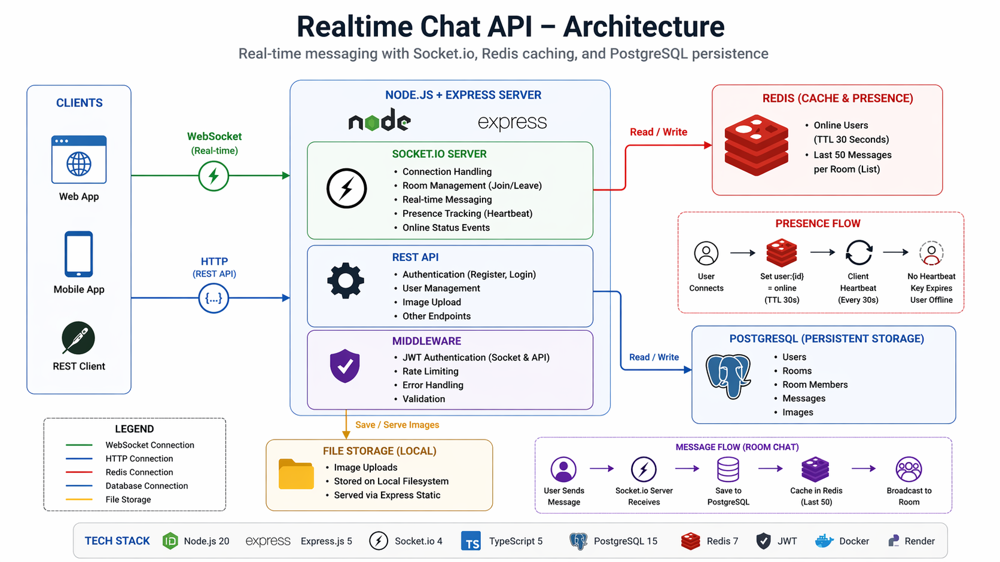

# Realtime Chat API

<div align="center">


**A real-time messaging backend designed to handle presence tracking, message delivery, and efficient data retrieval using WebSockets and Redis.**  
Users join rooms, exchange messages, and maintain accurate online status even during unexpected disconnects.

[Live API](https://realtime-chat-api-78gu.onrender.com/) · [GitHub](https://github.com/TirthWillLearn/Realtime-Chat-App)

</div>

---

## Table of Contents

- [Overview](#overview)
- [Key Engineering Highlights](#key-engineering-highlights)
- [Features](#features)
- [Architecture](#architecture)
- [Tech Stack](#tech-stack)
- [Project Structure](#project-structure)
- [Getting Started](#getting-started)
- [Docker](#docker)
- [Environment Variables](#environment-variables)
- [API Reference](#api-reference)
- [Socket Events](#socket-events)
- [Key Engineering Decisions](#key-engineering-decisions)
- [Security](#security)
- [Limitations & Future Improvements](#limitations--future-improvements)
- [Deployment](#deployment)
- [Author](#author)

---

## Overview

This API powers the backend of a real-time chat application. It handles user authentication, room-based group messaging, private DMs, image sharing, and online status tracking.

The core engineering challenge: **how do you track online status when a user's browser crashes without firing a disconnect event?** This is solved using Redis TTL — the status key auto-expires after 30 seconds unless renewed by a client heartbeat, ensuring ghost online statuses never persist.

---
## Key Engineering Highlights

- Handles presence tracking using Redis TTL to avoid stale "online" states
- Reduces database load by caching recent messages (last 50) in Redis
- Uses Socket.io middleware for one-time JWT authentication per connection
- Ensures consistent DM room creation using deterministic ID logic (`Math.min/max`)


## Features

## Features

- JWT authentication with socket-level authorization
- Real-time messaging using Socket.io (rooms + DMs)
- Presence tracking using Redis TTL with heartbeat mechanism
- Message caching (last 50 messages per room) for fast room joins
- Image upload and sharing via HTTP + broadcast via sockets
- Optimized PostgreSQL queries with proper indexing and constraints

## Architecture

High-level system design showing real-time message flow and presence tracking.



## Tech Stack

| Layer            | Technology    |
| ---------------- | ------------- |
| Runtime          | Node.js 20    |
| Framework        | Express.js    |
| Language         | TypeScript    |
| Database         | PostgreSQL 15 |
| Cache & Pub/Sub  | Redis 7       |
| Real-Time        | Socket.io 4   |
| Authentication   | JWT + bcrypt  |
| File Uploads     | Multer        |
| Containerization | Docker        |
| Hosting          | Render        |

---

## Project Structure

```
src/
├── index.ts                  # App entry point, middleware registration
├── config/
│   ├── db.ts                 # PostgreSQL connection pool
│   ├── redis.ts              # Redis connection with error handling
│   ├── multer.ts             # Multer config for image uploads
│   └── runMigrations.ts      # Migration runner
├── middleware/
│   └── auth.middleware.ts    # JWT socket auth middleware
├── routes/
│   ├── auth.route.ts         # Register and login endpoints
│   └── upload.route.ts       # Image upload endpoint
├── services/
│   ├── auth.service.ts       # bcrypt + JWT logic
│   └── message.service.ts    # DB persistence + Redis caching
├── socket/
│   └── index.ts              # All Socket.io event handlers
└── migrations/
    └── init.sql              # Database schema
```

---

## Getting Started

### Prerequisites

- Node.js 20+
- PostgreSQL 15+
- Redis 7+
- npm

### 1. Clone the repository

```bash
git clone https://github.com/TirthWillLearn/Realtime-Chat-App.git
cd Realtime-Chat-App
```

### 2. Install dependencies

```bash
npm install
```

### 3. Configure environment variables

```bash
cp .env.example .env
```

Fill in your database credentials, Redis config, and JWT secret (see [Environment Variables](#environment-variables)).

### 4. Create database tables

```bash
npx ts-node src/config/runMigrations.ts
```

Or run the SQL manually against your PostgreSQL database:

```sql
CREATE TABLE IF NOT EXISTS users (
  id SERIAL PRIMARY KEY,
  email VARCHAR(100) UNIQUE NOT NULL,
  password TEXT NOT NULL
);

CREATE TABLE IF NOT EXISTS rooms (
  id SERIAL PRIMARY KEY,
  name VARCHAR NOT NULL
);

CREATE TABLE IF NOT EXISTS room_members (
  room_id INT NOT NULL,
  user_id INT NOT NULL,
  PRIMARY KEY (room_id, user_id),
  FOREIGN KEY (room_id) REFERENCES rooms(id) ON DELETE CASCADE,
  FOREIGN KEY (user_id) REFERENCES users(id) ON DELETE CASCADE
);

CREATE TABLE IF NOT EXISTS messages (
  id SERIAL PRIMARY KEY,
  room_id INT NOT NULL,
  user_id INT NOT NULL,
  message TEXT NOT NULL,
  created_at TIMESTAMP DEFAULT CURRENT_TIMESTAMP,
  FOREIGN KEY (room_id) REFERENCES rooms(id) ON DELETE CASCADE,
  FOREIGN KEY (user_id) REFERENCES users(id) ON DELETE CASCADE
);
```

### 5. Start the development server

```bash
npm run dev
```

Server runs at `http://localhost:4000`

---

## Docker

### Build and run locally

```bash
docker-compose up --build
```

This starts three containers:

- **app** — Node.js API on port 4000
- **postgres** — PostgreSQL 15
- **redis** — Redis 7

### Build image only

```bash
docker build -t realtime-chat-api .
docker run --env-file .env.production -p 4000:4000 realtime-chat-api
```

---

## Environment Variables

```ini
PORT=4000

DB_HOST=localhost
DB_PORT=5432
DB_USER=your_db_user
DB_PASSWORD=your_db_password
DB_NAME=chat_app

REDIS_HOST=localhost
REDIS_PORT=6379
REDIS_PASSWORD=your_redis_password

JWT_SECRET=your_jwt_secret
NODE_ENV=development
```

> Never commit your `.env` file. Use `.env.example` as a reference template.

---

## API Reference

### Authentication

| Method | Endpoint             | Access | Description              |
| ------ | -------------------- | ------ | ------------------------ |
| POST   | `/api/auth/register` | Public | Register and receive JWT |
| POST   | `/api/auth/login`    | Public | Login and receive JWT    |

### Uploads

| Method | Endpoint       | Access | Description                    |
| ------ | -------------- | ------ | ------------------------------ |
| POST   | `/api/uploads` | Public | Upload image, receive URL back |

---

### Example: Register

**POST** `/api/auth/register`

```json
{
  "email": "tirth@example.com",
  "password": "securepass"
}
```

```json
{
  "token": "eyJhbGciOiJIUzI1NiIsInR5cCI6IkpXVCJ9..."
}
```

---

### Example: Login

**POST** `/api/auth/login`

```json
{
  "email": "tirth@example.com",
  "password": "securepass"
}
```

```json
{
  "token": "eyJhbGciOiJIUzI1NiIsInR5cCI6IkpXVCJ9..."
}
```

---

### Example: Upload Image

**POST** `/api/uploads` — `Content-Type: multipart/form-data`

```
field: image
value: [file]
```

```json
{
  "url": "https://realtime-chat-api-78gu.onrender.com/uploads/chat-1774467640822.jpeg"
}
```

---

## Socket Events

Connect to the server using a Socket.io client. Pass JWT in the handshake:

```js
const socket = io("https://realtime-chat-api-78gu.onrender.com/", {
  auth: { token: "Bearer your_jwt_token" },
});

```

### Emit (Client → Server)

| Event         | Payload           | Description                          |
| ------------- | ----------------- | ------------------------------------ |
| `joinRoom`    | `roomId`          | Join a chat room                     |
| `leaveRoom`   | `roomId`          | Leave a chat room                    |
| `sendMessage` | `roomId, message` | Send a message to a room             |
| `joinDM`      | `targetUserId`    | Start a private DM with another user |

### Listen (Server → Client)

| Event     | Payload               | Description                                |
| --------- | --------------------- | ------------------------------------------ |
| `message` | `string or object`    | Incoming message or cached message history |
| `error`   | `{ message: string }` | Error from server (e.g. failed to send)    |

---

### Example: Join Room and Send Message

```js
// Join room
socket.emit("joinRoom", 1);

// Receive cached messages on join
socket.on("message", (data) => {
  console.log(data);
});

// Send message
socket.emit("sendMessage", 1, "Hello everyone!");

// Receive broadcast
socket.on("message", (data) => {
  console.log(data);
  // { id: 5, room_id: 1, user_id: 2, message: "Hello everyone!", created_at: "..." }
});
```

---

### Example: Private DM

```js
// User 2 starts DM with User 5
socket.emit("joinDM", 5);
// Creates room: "dm:2:5"

// User 5 starts DM with User 2
socket.emit("joinDM", 2);
// Creates same room: "dm:2:5"

// Send message in DM room
socket.emit("sendMessage", "dm:2:5", "Hey, what's up?");
```

---

## Key Engineering Decisions

**Why Socket.io over raw WebSocket?**  
Raw WebSocket provides a persistent connection but no rooms, no events, no reconnection logic. Socket.io adds all of these out of the box, along with automatic fallback to long-polling for environments where WebSocket is blocked by proxies or firewalls.

**Why verify JWT at connection time, not per message?**  
WebSocket is a persistent connection — unlike HTTP there are no repeated requests. The JWT is verified once during the handshake and the user ID is stored on `socket.data.userId`. All subsequent events trust that verified identity for the lifetime of the connection.

**Why Redis for online status instead of PostgreSQL?**  
Online status changes on every connect and disconnect — potentially hundreds of times per minute per active user. Writing to PostgreSQL on every change would be prohibitively expensive. Redis operates in memory at sub-millisecond speeds and is purpose-built for ephemeral, high-frequency data.

**Why TTL on online status keys?**  
If a user's browser crashes, no disconnect event fires on the server. Without TTL, the user's status would remain "online" indefinitely. A 30-second TTL forces the client to send periodic heartbeats to renew the key. If no heartbeat arrives, the key expires automatically and the status disappears — the same pattern used in production presence systems.

**Why cache only the last 50 messages in Redis?**  
Users rarely scroll back more than 50 messages on room join. Caching all messages would consume unbounded Redis memory. By trimming the list to 50 entries on every insert, memory usage stays constant regardless of how many messages a room accumulates. Older messages remain safely in PostgreSQL.

**Why use `Math.min/max` for DM room names?**  
A DM between User 2 and User 5 must always resolve to the same room regardless of who initiates. Without sorting, User 2 → User 5 would create `dm:2:5` and User 5 → User 2 would create `dm:5:2` — two separate rooms. Using `Math.min/max` guarantees the smaller ID always comes first, producing an identical room name from either direction.

**Why store image URLs as messages instead of binary data?**  
Storing binary image data directly in PostgreSQL or Socket.io payloads would be impractical — databases are not designed for large binary objects and WebSocket frames have size limits. Instead, the image is uploaded via HTTP multipart to the server, saved to disk, and only the resulting URL is stored and broadcast via Socket.io.

---

## Security

- Passwords hashed with **bcrypt** (salt rounds: 10)
- JWT tokens expire after **30 days**
- Socket connections verified at handshake via JWT middleware — unauthorized connections rejected before any events fire
- File type validation via MIME type — only `image/*` accepted
- File size capped at **2MB** per upload
- Sensitive credentials managed via environment variables only
- `.env` and `.env.production` excluded from version control

---

## Limitations & Future Improvements

- Currently single-server (no horizontal scaling with Redis Pub/Sub)
- Presence tracking uses polling/TTL — can be optimized further with event-based sync
- Message history pagination not fully implemented beyond cached 50 messages
- Can be extended with load balancing and distributed socket handling


## Deployment

| Resource   | Platform                     |
| ---------- | ---------------------------- |
| API Server | Render                       |
| Database   | Render PostgreSQL            |
| Cache      | Redis Cloud                  |
| Live URL   | your-render-url.onrender.com |

---

## Author

**Tirth Patel** — Backend Developer

[](https://github.com/TirthWillLearn)
[](https://www.linkedin.com/in/tirth-k-patel/)
[](https://tirthdev.in)
